<div align="center">
  
# 📚 arXiv RAG Paper 

**A high-performance Retrieval-Augmented Generation (RAG) pipeline for querying arXiv research papers.**

[](https://www.python.org/downloads/)
[](https://aistudio.google.com/)
[](https://www.trychroma.com/)
[](https://streamlit.io/)
[](https://opensource.org/licenses/MIT)

</div>

---

**arXiv RAG Paper** empowers researchers and developers to intuitively search, summarize, and synthesize knowledge from academic papers. Built with a modular, lightweight architecture, it downloads academic papers directly from the arXiv API, embeds them locally using `sentence-transformers`, and leverages Google's fast **Gemini 1.5 Flash** to provide highly accurate, context-aware answers to complex queries.

## ✨ Features

- **📡 Direct arXiv Integration:** Automatically fetches and processes PDFs from arXiv based on your research topics.
- **🧠 Free & Local Embeddings:** Utilizes lightweight, state-of-the-art local sentence-transformers (`all-MiniLM-L6-v2`)—no embedding API costs.
- **⚡ Lightning Fast Synthesis:** Powered by Google's Gemini 1.5 Flash model for ultra-fast, high-quality answers.
- **🔪 Semantic Chunking:** Implements LlamaIndex's semantic splitters to maintain logical context boundaries when chunking PDFs.
- **🔍 Vector Search:** Blazing fast document retrieval powered by ChromaDB.
- **💻 Interactive UI:** Clean, responsive, and intuitive Streamlit interface for querying your personal knowledge base.

---

## 🏗️ Architecture

```mermaid
flowchart LR
    classDef default fill:#f9f9f9,stroke:#333,stroke-width:1px;
    classDef ingest fill:#e6d4f9,stroke:#b18bd0,stroke-width:2px;
    classDef embed fill:#fce4cc,stroke:#f2b279,stroke-width:2px;
    classDef vector fill:#cce8e1,stroke:#7ebfb1,stroke-width:2px;
    classDef query fill:#cce0f5,stroke:#7daeed,stroke-width:2px;
    classDef synth fill:#d4ecd0,stroke:#8ac57b,stroke-width:2px;
    classDef ui fill:#e6e6e6,stroke:#b3b3b3,stroke-width:2px;

    PDF["PDF"]

    subgraph INGESTION ["INGESTION PIPELINE"]
        direction TB
        fetcher["arxiv API fetcher"]
        extractor["pypdf extractor"]
        chunker["LlamaIndex semantic chunker"]
        
        fetcher -- "① pypdf" --> extractor
        extractor -- "② text" --> chunker
    end

    subgraph EMBEDDING ["EMBEDDING LAYER"]
        direction TB
        server["SentenceTransformers (Local)"]
        model["all-MiniLM-L6-v2 model"]
    end

    subgraph DB ["VECTOR STORE"]
        direction TB
        chroma["ChromaDB with cosine similarity"]
        filters["metadata filters"]
    end

    subgraph QUERY ["QUERY PIPELINE"]
        direction TB
        q_embed["query embedder"]
        retriever["top-k retriever"]
        formatter["chunk formatter"]
        
        q_embed --> retriever
        retriever --> formatter
    end

    subgraph SYNTHESIS ["SYNTHESIS"]
        direction TB
        api["Gemini 1.5 Flash API"]
        prompt_eng["citation prompt engine"]
        ans_build["answer builder"]
    end

    subgraph UI ["UI LAYER"]
        direction TB
        stream["Streamlit frontend"]
        sidebar["sidebar stats"]
        source_exp["source expander"]
        
        stream --> sidebar
        stream --> source_exp
    end

    %% Internal subgraph flows and loose links
    server --- model
    chroma --- filters
    api --- prompt_eng
    prompt_eng --- ans_build

    %% External Inputs & Cross-subgraph links
    PDF --> extractor
    chunker -- "③ chunks" --> server
    model -- "③ vectors" --> chroma
    
    stream -- "④" --> q_embed
    chroma --> retriever
    filters -- "⑤ retrieve" --> retriever
    
    formatter --> prompt_eng
    source_exp -- "⑥" --> prompt_eng
    ans_build -- "⑦ cited answer" --> source_exp

    %% Styling classes
    class INGESTION,fetcher,extractor,chunker ingest;
    class EMBEDDING,server,model embed;
    class DB,chroma,filters vector;
    class QUERY,q_embed,retriever,formatter query;
    class SYNTHESIS,api,prompt_eng,ans_build synth;
    class UI,stream,sidebar,source_exp ui;
```



---

## 🚀 Quick Start

### 1. Prerequisites
- Python 3.10 or higher
- A free Google Gemini API Key. Get yours at [Google AI Studio](https://aistudio.google.com/apikey).

### 2. Installation
Clone the repository and install the required dependencies:

```bash
git clone https://github.com/yourusername/arxiv-RAG-Paper.git
cd arxiv-RAG-Paper

# Create a virtual environment (optional but recommended)
python -m venv venv
source venv/bin/activate  # On Windows use: venv\Scripts\activate

# Install dependencies
pip install -r requirements.txt
```

### 3. Environment Setup
Create a `.env` file in the root directory and add your Gemini API Key:

```bash
echo "GEMINI_API_KEY=your_gemini_api_key_here" > .env
```

### 4. Build the Knowledge Base
Run the ingestion pipeline to fetch papers from arXiv, process them, and populate the vector database:

```bash
python -m pipeline.ingest_pipeline
```

### 5. Launch the Application
Start the Streamlit interface to begin querying your newly built research knowledge base:

```bash
streamlit run app/main.py
```
*The app will be available at `http://localhost:8501`*

---

## 🛠️ Tech Stack

| Component | Technology | Description |
| :--- | :--- | :--- |
| **LLM** | [Gemini 1.5 Flash](https://deepmind.google/technologies/gemini/flash/) | Google's fast, multimodal model (Free Tier) |
| **Embeddings** | [sentence-transformers](https://sbert.net/) | `all-MiniLM-L6-v2` (Local, high-efficiency) |
| **Vector DB** | [ChromaDB](https://www.trychroma.com/) | Open-source embedding database |
| **Chunking** | [LlamaIndex](https://www.llamaindex.ai/) | Advanced semantic parsing & chunking |
| **PDF Parsing** | [pypdf](https://pypdf.readthedocs.io/) | Pure-python PDF extraction library |
| **Frontend** | [Streamlit](https://streamlit.io/) | Interactive data web application framework |

---

## 📂 Project Structure

```text
arxiv-RAG-Paper/
├── app/                  # Streamlit UI (entry point + frontend components)
│   └── main.py
├── config/               # Configuration settings & prompt templates
│   └── settings.py
├── core/                 # Pure functions, core abstractions
│   ├── chunker.py        # Semantic text splitting
│   ├── embedder.py       # Sentence-transformers wrapper
│   ├── extractor.py      # PDF text parsing
│   ├── fetcher.py        # arXiv API integration
│   └── vectorstore.py    # ChromaDB operations
├── pipeline/             # Orchestration layer tying core modules together
│   ├── ingest_pipeline.py# Runs the end-to-end ingestion job
│   ├── query.py          # Vector retrieval logic
│   └── synthesizer.py    # Gemini API prompt generation
├── tests/                # Automated tests
├── papers/               # Local storage for downloaded PDFs
├── chroma_db/            # Local persistent vector database
├── requirements.txt      # Python dependencies
└── Makefile              # Shortcut commands
```

---

## 🧪 Testing

The project uses `pytest` for unit testing the core components. To run the test suite:

```bash
pytest tests/ -v
```

---

## 🤝 Contributing

Contributions make the open source community such an amazing place to learn, inspire, and create. Any contributions you make are **greatly appreciated**.

1. Fork the Project
2. Create your Feature Branch (`git checkout -b feature/AmazingFeature`)
3. Commit your Changes (`git commit -m 'Add some AmazingFeature'`)
4. Push to the Branch (`git push origin feature/AmazingFeature`)
5. Open a Pull Request

---

## 📜 License

Distributed under the MIT License. See `LICENSE` for more information.

<div align="center">
  <i>If you find this project useful, please consider giving it a ⭐!</i>
</div>
